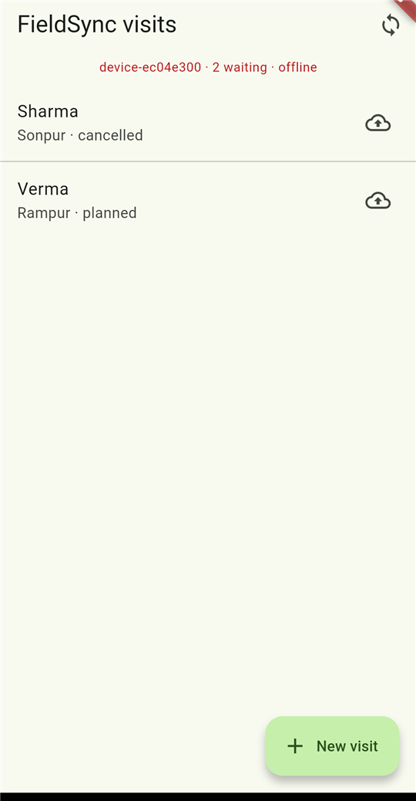
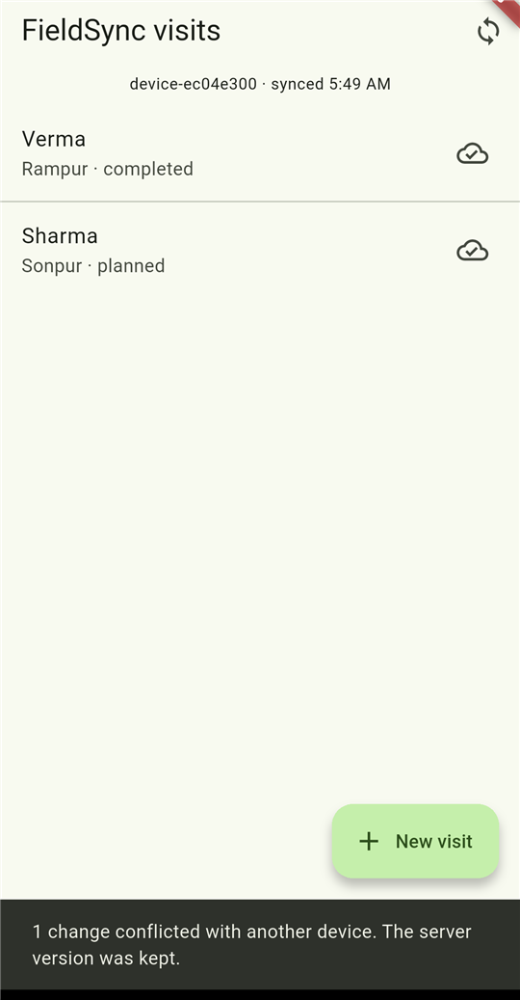

# FieldSync

An offline-first sync engine for field data collection: a Java 21 / Spring Boot 4 / PostgreSQL
server and a Flutter client that works with no network at all.

[](https://github.com/prtkgrg/fieldsync/actions/workflows/ci.yml)


Field workers collect data on phones that are offline for hours or days. When they reconnect,
their changes have to reach the server and every other device without losing anyone's work. That
has to hold even if two people edited the same record, a request is retried over a bad network, or
a record was deleted in the meantime.

I led this kind of system at national scale on [MEDplat](https://prateekgarg.dev), where it served
300 million people across 12 deployments. FieldSync is a small, public version of the same problem,
built to show the design.

<p align="center">
  
  &nbsp;
  
</p>
<p align="center"><sub>Left: offline, with edits saved locally and queued. Right: after reconnecting, with changes pushed, another
device's edits pulled in, and the one field both devices changed reported.</sub></p>

## How it works

```
 device (offline)                                server
 ─────────────────                               ──────────────────────────────
 records edited locally,        POST /push       lock → for each mutation:
 each change queued as a   ───────────────────▶    already applied? return stored result
 mutation with a UUID                              else merge field by field, write, log
                                                  ◀── per-mutation result + new version
                                GET /pull?cursor=
 applies changes, stores   ───────────────────▶  rows with version > cursor, in order
 nextCursor for next time  ◀───────────────────  (tombstones included)
```

### Push: upload offline changes

```http
POST /api/v1/sync/push
{
  "deviceId": "phone-b",
  "mutations": [{
    "mutationId": "74198c31-…",          // generated on the device: makes retries safe
    "recordId":   "11111111-…",          // generated on the device: records can be created offline
    "type": "visit",
    "op": "UPSERT",                      // or DELETE
    "baseVersion": 1,                    // the version this device last saw
    "fields": { "village": "Sonpur", "status": "cancelled" }
  }]
}
```

```json
{ "results": [{
    "status": "CONFLICT", "version": 3,
    "conflicts": [{ "field": "status", "clientValue": "cancelled", "serverValue": "completed",
                    "reason": "Changed on the server since version 1" }]
}]}
```

Here another device had already set `status` to `completed`. The `village` change merged, the
`status` change conflicted, and the server value was kept and reported back.

### Pull: download everything that changed

```http
GET /api/v1/sync/pull?cursor=0&limit=500
→ { "records": [ … ], "nextCursor": 3, "hasMore": false }
```

Keep pulling with `nextCursor` until `hasMore` is false. Interactive docs are at `/swagger-ui.html`.

## Design decisions

**Per-field merge, not last-write-wins.** Every field remembers the version that last wrote it. A
change conflicts only if the server changed *that field* after the device's `baseVersion` and the
device set it to a different value. Two workers updating different fields of the same record both
keep their work. Record-level last-write-wins would silently drop one of them.

**Conflicts: server wins, loudly.** When a field genuinely conflicts, the server value is kept, the
device is told exactly which field and both values, and the conflict is stored in `sync_conflicts`
for audit. Identical concurrent edits aren't conflicts. The rules are pure functions in
[`MergeEngine`](src/main/java/dev/prateekgarg/fieldsync/sync/MergeEngine.java), unit-tested
case by case.

**Idempotent push.** Mobile networks drop responses, so devices retry. Each mutation carries a
UUID made on the device. Applied mutations and their results are stored in the same transaction as
the write, so a retry returns the original response instead of applying twice.

**A pull cursor that can't skip rows.** Every write takes the next value from a single sequence,
and pull returns `version > cursor`. The classic bug: transaction A takes version 10, B takes 11,
B commits first, and a device pulls 11. A then commits version 10 *behind* the device's cursor, and
that change is lost for good. FieldSync serializes pushes with a PostgreSQL advisory lock, so
versions commit in order and a reader that sees version N has already seen everything below it.
An integration test pulls continuously while 8 threads push and checks that nothing is missed.

**Deletes are tombstones.** A deleted record stays as a marker so other offline devices learn about
it on their next pull. Delete wins: deleting beats concurrent edits, and editing a deleted record
is reported as a conflict.

**Plain SQL instead of JPA.** Sync depends on exact control of locking, ordering and JSONB, so the
store uses Spring's `JdbcClient` with explicit SQL. Record fields are JSONB, so new form fields
need no migrations, much like the configuration-driven approach I used on MEDplat.

### Trade-offs

- **One writer at a time.** The advisory lock trades push throughput for correctness and
  simplicity. Pushes are short batches, and reads aren't blocked. At higher write volumes I'd
  partition the lock by tenant or deployment, or move to a commit-ordered change log
  (for example logical decoding).
- **Server-wins conflicts.** This is simple and predictable for field data. Some fields suit other
  rules (counters, sets), and the merge engine is the one place to add them.
- **Not included:** authentication, per-user data scoping and tombstone compaction. A real
  deployment needs all three.

## The Flutter client

[`app/`](app) is a small Android app for household visits, built with Flutter, Bloc, GetIt and
SQLite.

**Local first.** Every save writes to SQLite and queues a mutation in an **outbox** in the same
transaction, so the UI never waits for the network. The status bar shows how many changes are
waiting and when the last sync succeeded. Being offline is a normal state, not an error screen.

**Sync is push then pull.** The
[`SyncEngine`](app/lib/sync/sync_engine.dart) sends the outbox, then pulls until caught up. It
runs on demand and every 30 seconds while the app is open.

**Decisions that made it correct:**
- **One mutation per record per request.** The server judges each change against the device's
  `baseVersion`. Two queued edits to the same record in one request would make the second look
  like a conflict with the first. Unsent edits are merged into one outbox row, and each push round
  takes only the oldest change per record.
- **Base versions are read at send time,** not when the edit is queued, so a later edit builds on
  this device's own previous write.
- **Rebase on pull.** Edits made while a sync is running are re-applied on top of the incoming
  server copy, so nothing typed on the device is lost.
- **Only send what changed.** The edit form sends only the fields the user touched. An early
  version sent every field. During the live test that turned another device's real `notes` edit
  into a false conflict, and a widget test now covers it.
- **Safe to interrupt.** A failed push puts the batch back with the same mutation IDs, so a push
  that actually reached the server isn't applied twice. The pull cursor advances only in the same
  transaction that applies each page.

Tested with an in-memory SQLite database and a fake server: 10 sync-engine tests cover queueing,
merging edits, resending after failure, paging through 1,000+ records, rebase, delete-wins and
conflict logging. There are also 2 widget tests for the form.

## Run it

Requires Java 21 and Docker.

```bash
./mvnw spring-boot:run     # starts PostgreSQL via Docker Compose, runs Flyway migrations
```

The API is at http://localhost:8080 and the docs at http://localhost:8080/swagger-ui.html.

```bash
./mvnw verify              # unit tests + Testcontainers integration tests
```

Then run the app on an Android emulator. It reaches the host machine at `10.0.2.2:8080`.

```bash
cd app
flutter run                # or: flutter run --dart-define=SERVER_URL=http://<your-ip>:8080
flutter test
```

## Tech

**Server:** Java 21 · Spring Boot 4.1 (Web MVC, JDBC, Validation, Actuator) · PostgreSQL 17 with
JSONB · Flyway · Testcontainers · JUnit 5 and AssertJ · springdoc OpenAPI · Docker Compose

**Client:** Flutter · Dart · flutter_bloc · GetIt · sqflite · http

**CI:** GitHub Actions runs both test suites on every push.

## Roadmap

- [x] Flutter client with a local SQLite store and an outbox
- [ ] Background sync when the app is closed (WorkManager)
- [ ] A conflicts screen, so users can review what the server kept
- [ ] Authentication and per-user data scoping
- [ ] Tombstone compaction

---

Built by [Prateek Garg](https://prateekgarg.dev), a lead engineer working on Java and Flutter.
